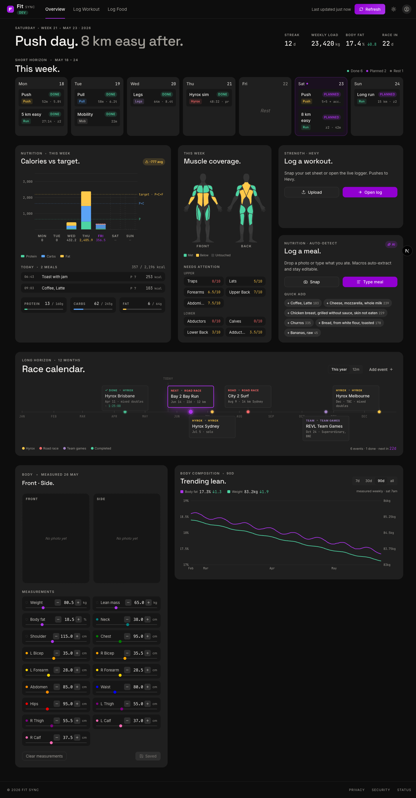
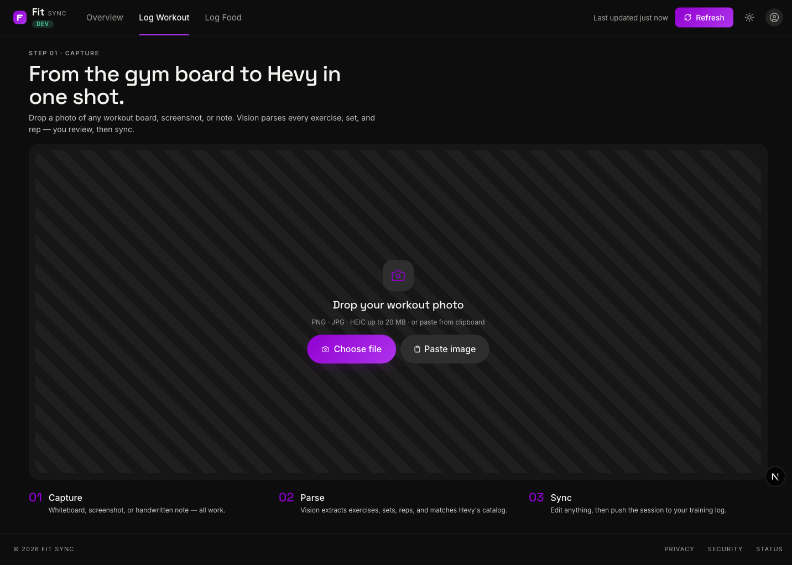
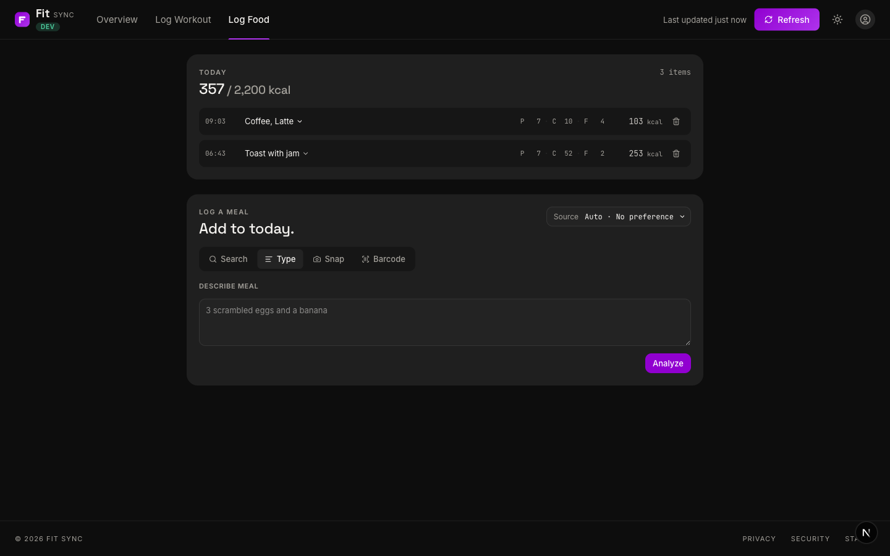

# Fit Sync

A personal fitness-tracking hub that pulls the whole training picture into one dashboard — strength, cardio, nutrition, body composition, and racing. 
It ties together several integrated functionalities:

- **Workout sync** — upload a workout photo; vision extracts exercises, sets, and reps, matches them to Hevy's catalog, and pushes the result to Hevy.
- **Food / macro log** — log meals via search, free text, photo, or barcode against a local Postgres-backed macro store with time-boxed targets.
- **Weekly training agenda** — a 7-day plan-vs-done view that merges planned sessions (Google Calendar) with completed ones (Hevy + Garmin), with a navigable week slider to review past weeks.
- **Activity sync** — Garmin runs, walks, and other cardio synced and reconciled against Hevy lifts (no double-counting).
- **Body composition** — measurements card plus weight and body-fat trend over time.
- **Race calendar** — track upcoming events, log results, and count down to the next race.

A single dashboard surfaces it all: weekly workout/run summary, muscle coverage, calories vs target, body-composition trend, a race countdown, and the merged weekly agenda.

Built with Next.js 16, React 19, TypeScript, Tailwind v4, shadcn/ui, Drizzle, and Postgres.

## Screenshots

### Dashboard

Muscle coverage, calories vs target, weekly agenda, race timeline, and body-composition trend in one view.



### Workout sync (Hevy)

Drop a workout photo — vision parses every exercise, set, and rep, then matches Hevy's catalog.



### Food / macro log

Log meals by search, brand lookup, text, photo, or barcode against the local macro store.



## Features

### Workout sync (Hevy)
- Photo upload with EXIF date extraction (HEIC/HEIF supported)
- Groq Vision (Llama 4 Scout) extracts exercises, sets, reps, weights
- Optional agent harness (tool-use loop via Groq, LM Studio, or local Claude CLI)
- Fuzzy + embedding match against Hevy's catalog (461 exercises)
- Review and edit before sync; duplicate detection by date

### Food / macro log
- Backed by [food-macro-api](https://github.com/voqilabs/food-macro-api) (FMA) for search and analysis
- Five input modes: search, Open Food Facts brand lookup, text, photo, barcode
- Persistent log in local Postgres (Drizzle ORM)
- Time-boxed macro targets, week stack, quick-add chips

### Dashboard
- Muscle coverage map driven by recent Hevy workouts
- Calorie/macro summary against active target
- Body measurements card and trend chart
- Weekly agenda merging planned (Google Calendar) and done (Hevy + Garmin) sessions
- Race timeline counting down to the next event

### Weekly agenda (Garmin + Google Calendar)
- 7-day Mon–Sun view that flips per day at 21:00 local time: planned (calendar) → done (Hevy + Garmin)
- Calendar events filtered to `Move` / `Perform` / `Race` / `Track` titles
- Garmin activities overlapping a Hevy lift are de-duped (Hevy stays source of truth)
- Garmin synced via a Python subprocess; calendar via a Google service-account JWT
- Manual sync (in-app Refresh server action) + cron sync (`POST /api/agenda/sync` with a shared secret)
- Garmin + calendar cached in Postgres; Hevy read live each request
- Pure, unit-tested merge in `lib/dashboard/agenda.ts` (`now` + `tz` injected)

### Race calendar
- Track races by category (Hyrox, Running, Team games) with location, notes, and event targets
- Log results (finish time + placement) after events
- Grouped by year and status (upcoming / next / past) with a days-until countdown
- 12-month visual timeline on the dashboard
- Stored in Postgres (Drizzle); seeded via `npm run db:seed`

> 3D body visualisation is on the roadmap — see
> https://github.com/datar-psa/clad-body for the candidate model
> when this lands.

## Tech stack

- **Framework:** Next.js 16 (App Router), React 19, TypeScript
- **Styling:** Tailwind v4, shadcn/ui (New York), Radix, lucide-react
- **State:** React Context providers (workout, hevy, food log, measurements, agenda, race)
- **Vision:** Groq API (Llama 4 Scout) or local LM Studio; optional agent harness
- **Matching:** Fuzzy (Levenshtein + bonuses) blended with embeddings (LM Studio / Transformers.js)
- **Charts:** Recharts (body-composition trend)
- **Persistence:** Postgres 16 + Drizzle ORM (food log, macro targets, races, Garmin + calendar cache)
- **External APIs:** Hevy, Groq, FMA, Open Food Facts, Garmin (via Python subprocess), Google Calendar (service account)
- **Image processing:** EXIF (exifr), HEIC convert (heic-convert), zoom/pan (react-zoom-pan-pinch)
- **Containers:** Multi-stage Dockerfile, standalone output, ready for TrueNAS Scale

## Getting started

### Prerequisites
- Node.js 22+ (no `.nvmrc` yet)
- Docker or Podman (for local Postgres + FMA)
- A running [food-macro-api](https://github.com/voqilabs/food-macro-api) instance if you want the food log
- Python 3 + `garminconnect` (optional — only for the Garmin side of the weekly agenda)

### Install

```bash
git clone <repository-url>
cd workout-sync
npm install
cp .env.example .env.local     # fill in keys
docker compose up -d db        # local Postgres on :5433
npm run db:migrate
npm run db:seed                # optional, seeds a starter macro target + sample races
npm run dev                    # http://localhost:3000
```

Without `GROQ_API_KEY` the workout extraction falls back to mock data and the UI shows a warning banner. Without `FMA_BASE_URL`/`FMA_API_KEY` the food routes return errors. The Garmin + Calendar vars are optional — without them the weekly agenda just shows Hevy sessions and an empty planned side.

## Environment variables

See `.env.example` for the full template. Highlights:

| Var | Required | Purpose |
|-----|----------|---------|
| `GROQ_API_KEY` | recommended | Workout vision extraction |
| `HEVY_API_KEY` | for sync | Hevy API (catalog refresh + workout push) |
| `FMA_BASE_URL` | for food log | food-macro-api base URL |
| `FMA_API_KEY` | for food log | FMA bearer token |
| `DATABASE_URL` | for food log | Postgres connection string |
| `USER_TZ` | optional | IANA timezone for day-boundary aggregation + the agenda 21:00 day-switch |
| `GARMIN_EMAIL` / `GARMIN_PASSWORD` | for agenda | Garmin credentials — `fetch.py` auto-mints + refreshes the token (requires **2FA off**; stores the password at rest) |
| `GARMIN_TOKEN_DIR` | optional | Container-local token cache (default `/tmp/garmin-token`, no volume) |
| `GARMIN_TOKEN_B64` | optional | First-boot token seed, minted off-box via `scripts/garmin/bootstrap.py`; superseded by `GARMIN_EMAIL`/`GARMIN_PASSWORD` |
| `GOOGLE_SA_KEY` | for agenda | Google service-account key (inline JSON, base64, or file path) |
| `GCAL_ID` | for agenda | Calendar id to read (the calendar's address, not `primary`) |
| `AGENDA_SYNC_SECRET` | for cron | Shared secret for `POST /api/agenda/sync`; required on internet-exposed deploys |
| `MATCHING_MODE` | optional | `fuzzy` / `vector` / `both` |
| `EMBEDDING_SOURCE` | optional | `auto` / `lm-studio` / `transformers` / `off` |
| `AGENT_HARNESS_PROVIDER` | optional | `off` / `groq` / `lm-studio` / `claude-cli` |

Full list with defaults: `docs/architecture.md` and `docs/agenda-integration.md`.

## Scripts

```bash
npm run dev                       # Next.js dev server
npm run build                     # production build (prebuild refreshes Hevy catalog + embeddings)
npm run lint                      # ESLint
npm test                          # Jest
npm run test:watch                # Jest watch

npm run db:up                     # start local Postgres
npm run db:down                   # stop it
npm run db:generate               # drizzle-kit generate (after schema edit)
npm run db:migrate                # apply migrations
npm run db:seed                   # seed a default macro target + sample races
npm run db:reset                  # nuke volume + remigrate + reseed

npm run refresh:hevy              # refresh Hevy catalog snapshot
npm run build:embeddings          # build embedding catalogs (auto provider)
npm run build:embeddings:both     # build LM Studio + Transformers.js catalogs
npm run build:embeddings:check    # exit 0 if catalogs up-to-date

npm run e2e:matching              # matching only
npm run e2e:full                  # Groq + matching (needs GROQ_API_KEY)
npm run e2e:heic                  # HEIC + Groq

npm run debug:match -- "DB Curl"  # score breakdown for one query
npm run compare:modes             # compare matching modes side by side
npm run agent:extract -- tests/fixtures/workout-revl-1.jpeg
```

## Container deployment

### Build

```bash
podman build -t workout-sync:latest .
# Multi-arch (for TrueNAS):
podman buildx build --platform linux/amd64 -t workout-sync:amd64 .
```

The image bundles a Python venv for the Garmin subprocess and COPYs `scripts/garmin/` into the runner (Next standalone output excludes it). `GARMIN_PYTHON` is set to the venv interpreter inside the image.

### Run

```bash
podman run -d \
  --name workout-sync \
  -p 3000:3000 \
  -e HEVY_API_KEY=... \
  -e GROQ_API_KEY=... \
  -e DATABASE_URL=... \
  -e FMA_BASE_URL=... \
  -e FMA_API_KEY=... \
  -e USER_TZ=Australia/Brisbane \
  -e GARMIN_EMAIL=... \
  -e GARMIN_PASSWORD=... \
  -e GOOGLE_SA_KEY=... \
  -e GCAL_ID=... \
  -e AGENDA_SYNC_SECRET=... \
  workout-sync:latest
```

### Push to Docker Hub

```bash
podman login docker.io
podman tag workout-sync:latest docker.io/<user>/workout-sync:v0.3.0
podman push docker.io/<user>/workout-sync:v0.3.0
```

### TrueNAS Scale

Apps → Custom App → Install. Set image repo, env vars, port mapping (container 3000). For private repos configure Docker Hub credentials. To keep the agenda fresh, point a cron at `POST /api/agenda/sync` with the `x-sync-secret` header set to `AGENDA_SYNC_SECRET`.

See `docs/architecture.md` for the deployment env table and embedding/agent-harness options inside containers, and `docs/agenda-integration.md` for the Garmin + Calendar setup.

## Architecture

Single source of truth: `docs/architecture.md`. Quick map:

```
Photo / barcode / text / search input
   ↓
/api/process-workout (Groq or agent harness)        /api/food/{search,off-search,analyze/*}
   ↓                                                  ↓
fuzzy + embedding match (Hevy catalog)              food-macro-api (FMA) + Open Food Facts
   ↓                                                  ↓
review / edit                                       review / edit
   ↓                                                  ↓
/api/hevy-sync → Hevy API                           /api/food/log → Postgres
   ↓                                                  ↓
hevy-provider (last 14d, muscle coverage)           food-log-provider (today, week, target, quick-add)
                       \                            /
                        dashboard (`app/dashboard`)
                       /                            \
agenda-provider (/api/agenda)                race-provider (/api/races)
  Hevy + Garmin + Google Calendar              Postgres race_event
```

## Data structures

Exercise (Hevy shape):

```ts
{
  id: "uuid",
  title: "Exercise Name",
  type: "weight_reps",
  primary_muscle_group: "chest",
  secondary_muscle_groups: ["triceps"],
  is_custom: false,
  equipment: "barbell"
}
```

Workout:

```ts
{
  id: "uuid",
  date: Date,
  duration_minutes: number,
  caption: string,
  exercises: WorkoutExercise[]
}
```

Food log entry (Drizzle, see `lib/food/schema.ts`):

```ts
{
  id, batchId, loggedAt, source,
  name, grams,
  kcal, proteinG, carbsG, fatG,
  kcalPerG, proteinPerG, carbsPerG, fatPerG, // for local rescale on edit
  fmaFoodId, fmaSource, fmaSourceId,
  confidence, warnings, rawResponse, mealName, note
}
```

Race event (Drizzle, see `lib/db/schema/race.ts`):

```ts
{
  id, name, date, category,         // category: hyrox | running | team | ...
  eventTarget, location, note,
  resultTime, resultPlacement, resultNote,
  createdAt, updatedAt
}
```

## License

MIT. See [LICENSE](LICENSE).
