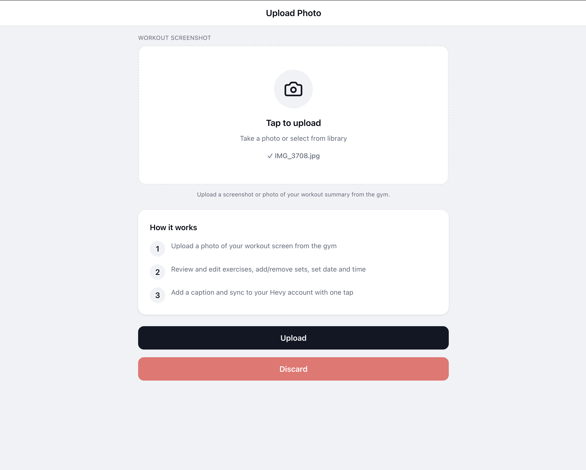
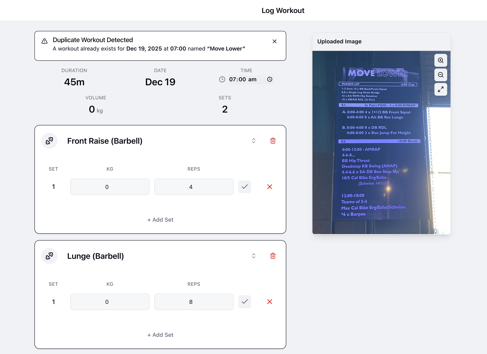
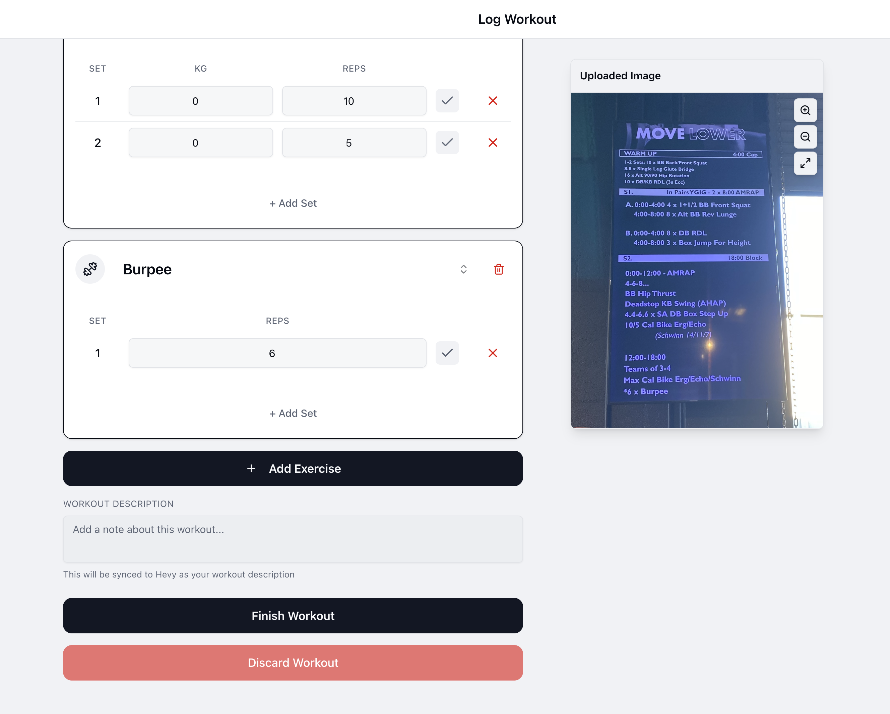

# Workout Sync

Mobile-first dashboard that combines a Hevy workout sync flow with a food/macro logger. Upload a workout photo and the app extracts exercises, matches them to Hevy's catalog, and pushes the result to Hevy. Log meals via search, free text, photo, or barcode against a local Postgres-backed macro store. A single dashboard pulls both together.

Built with Next.js 16, React 19, TypeScript, Tailwind v4, shadcn/ui, Drizzle, and Postgres.

## Screenshots





## Features

### Workout sync (Hevy)
- Photo upload with EXIF date extraction (HEIC/HEIF supported)
- Groq Vision (Llama 4 Scout) extracts exercises, sets, reps, weights
- Optional agent harness (tool-use loop via Groq, LM Studio, or local Claude CLI)
- Fuzzy + embedding match against Hevy's catalog (459 exercises)
- Review and edit before sync; duplicate detection by date

### Food / macro log
- Backed by [food-macro-api](https://github.com/voqilabs/food-macro-api) (FMA) for search and analysis
- Four input modes: search, text, photo, barcode
- Persistent log in local Postgres (Drizzle ORM)
- Time-boxed macro targets, week stack, quick-add chips

### Dashboard
- Muscle coverage map driven by recent Hevy workouts
- Calorie/macro summary against active target
- Body measurements card and trend chart

> 3D body visualisation is on the roadmap — see
> https://github.com/datar-psa/clad-body for the candidate model
> when this lands.

## Tech stack

- **Framework:** Next.js 16 (App Router), React 19, TypeScript
- **Styling:** Tailwind v4, shadcn/ui (New York), Radix, lucide-react
- **State:** React Context providers (workout, hevy, food log, measurements)
- **Vision:** Groq API (Llama 4 Scout) or local LM Studio; optional agent harness
- **Matching:** Fuzzy (Levenshtein + bonuses) blended with embeddings (LM Studio / Transformers.js)
- **Persistence:** Postgres 16 + Drizzle ORM (food log + macro targets)
- **External APIs:** Hevy, Groq, FMA
- **Image processing:** EXIF (exifr), HEIC convert (heic-convert), zoom/pan (react-zoom-pan-pinch)
- **Containers:** Multi-stage Dockerfile, standalone output, ready for TrueNAS Scale

## Getting started

### Prerequisites
- Node.js 22+ (no `.nvmrc` yet)
- Docker or Podman (for local Postgres + FMA)
- A running [food-macro-api](https://github.com/voqilabs/food-macro-api) instance if you want the food log

### Install

```bash
git clone <repository-url>
cd workout-sync
npm install
cp env.example .env.local      # fill in keys
docker compose up -d db        # local Postgres on :5433
npm run db:migrate
npm run db:seed                # optional, seeds a starter macro target
npm run dev                    # http://localhost:3000
```

Without `GROQ_API_KEY` the workout extraction falls back to mock data and the UI shows a warning banner. Without `FMA_BASE_URL`/`FMA_API_KEY` the food routes return errors.

## Environment variables

See `env.example` for the full template. Highlights:

| Var | Required | Purpose |
|-----|----------|---------|
| `GROQ_API_KEY` | recommended | Workout vision extraction |
| `HEVY_API_KEY` | for sync | Hevy API (catalog refresh + workout push) |
| `FMA_BASE_URL` | for food log | food-macro-api base URL |
| `FMA_API_KEY` | for food log | FMA bearer token |
| `DATABASE_URL` | for food log | Postgres connection string |
| `USER_TZ` | optional | IANA timezone for day-boundary aggregation |
| `MATCHING_MODE` | optional | `fuzzy` / `vector` / `both` |
| `EMBEDDING_SOURCE` | optional | `auto` / `lm-studio` / `transformers` / `off` |
| `AGENT_HARNESS_PROVIDER` | optional | `off` / `groq` / `lm-studio` / `claude-cli` |

Full list with defaults: `docs/architecture.md`.

## Scripts

```bash
npm run dev                       # Next.js dev server
npm run build                     # production build (prebuild refreshes Hevy catalog + embeddings)
npm run lint                      # ESLint
npm test                          # Jest
npm run test:watch                # Jest watch

npm run db:up                     # start local Postgres
npm run db:down                   # stop it
npm run db:generate               # drizzle-kit generate (after schema edit)
npm run db:migrate                # apply migrations
npm run db:seed                   # seed a default macro target
npm run db:reset                  # nuke volume + remigrate + reseed

npm run refresh:hevy              # refresh Hevy catalog snapshot
npm run build:embeddings          # build embedding catalogs (auto provider)
npm run build:embeddings:both     # build LM Studio + Transformers.js catalogs
npm run build:embeddings:check    # exit 0 if catalogs up-to-date

npm run e2e:matching              # matching only
npm run e2e:full                  # Groq + matching (needs GROQ_API_KEY)
npm run e2e:heic                  # HEIC + Groq

npm run debug:match -- "DB Curl"  # score breakdown for one query
npm run agent:extract -- tests/fixtures/workout-revl-1.jpeg
```

## Container deployment

### Build

```bash
podman build -t workout-sync:latest .
# Multi-arch (for TrueNAS):
podman buildx build --platform linux/amd64 -t workout-sync:amd64 .
```

### Run

```bash
podman run -d \
  --name workout-sync \
  -p 3000:3000 \
  -e HEVY_API_KEY=... \
  -e GROQ_API_KEY=... \
  -e DATABASE_URL=... \
  -e FMA_BASE_URL=... \
  -e FMA_API_KEY=... \
  workout-sync:latest
```

### Push to Docker Hub

```bash
podman login docker.io
podman tag workout-sync:latest docker.io/<user>/workout-sync:v0.3.0
podman push docker.io/<user>/workout-sync:v0.3.0
```

### TrueNAS Scale

Apps → Custom App → Install. Set image repo, env vars, port mapping (container 3000). For private repos configure Docker Hub credentials.

See `docs/architecture.md` for deployment env table and embedding/agent-harness options inside containers.

## Architecture

Single source of truth: `docs/architecture.md`. Quick map:

```
Photo / barcode / text / search input
   ↓
/api/process-workout (Groq or agent harness)        /api/food/{search,analyze/*}
   ↓                                                  ↓
fuzzy + embedding match (Hevy catalog)              food-macro-api (FMA)
   ↓                                                  ↓
review / edit                                       review / edit
   ↓                                                  ↓
/api/hevy-sync → Hevy API                           /api/food/log → Postgres
   ↓                                                  ↓
hevy-provider (last 14d, muscle coverage)           food-log-provider (today, week, target, quick-add)
                       \                            /
                        dashboard (`app/dashboard`)
```

## Data structures

Exercise (Hevy shape):

```ts
{
  id: "uuid",
  title: "Exercise Name",
  type: "weight_reps",
  primary_muscle_group: "chest",
  secondary_muscle_groups: ["triceps"],
  is_custom: false,
  equipment: "barbell"
}
```

Workout:

```ts
{
  id: "uuid",
  date: Date,
  duration_minutes: number,
  caption: string,
  exercises: WorkoutExercise[]
}
```

Food log entry (Drizzle, see `lib/food/schema.ts`):

```ts
{
  id, batchId, loggedAt, source,
  name, grams,
  kcal, proteinG, carbsG, fatG,
  kcalPerG, proteinPerG, carbsPerG, fatPerG, // for local rescale on edit
  fmaFoodId, fmaSource, fmaSourceId,
  confidence, warnings, rawResponse, mealName, note
}
```

## License

MIT. See [LICENSE](LICENSE).
